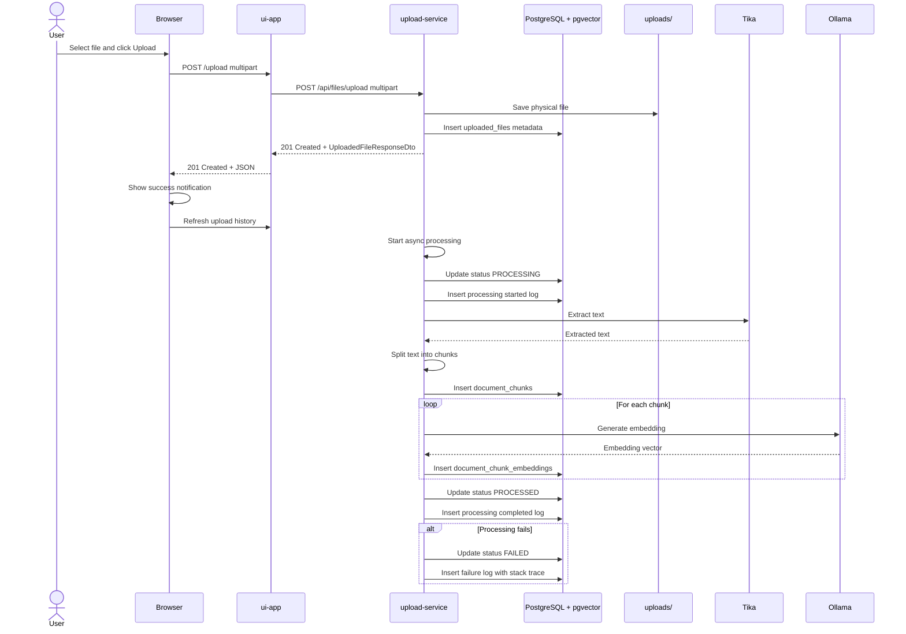

Upload file flow:

Browser flow:

    Browser
    ↓
    ui-app
    ↓
    upload-service
    ↓
    PostgreSQL

Semantic search flow:

    Browser
    ↓ /search
    ui-app
    ↓ /api/search
    upload-service
    ↓ Ollama embedding
    PostgreSQL pgvector similarity search
    ↓
    semantic results

Backend flow:  

    upload request
    ↓
    save file
    ↓
    save metadata
    ↓
    HTTP response returned immediately
    ↓
    background processing starts
    ↓
    extract text with Tika
    ↓
    split into chunks
    ↓
    save chunks
    ↓
    generate Ollama embedding
    ↓
    save embedding into pgvector table
    ↓
    search query
    ↓
    generate query embedding with Ollama
    ↓
    compare query vector with stored chunk vectors
    ↓
    return best matching chunks

# frontend

index.html      layout only
api.js          HTTP calls
navigation.js   menu behavior
upload.js       upload feature
history.js      history table + actions
details.js      file details rendering
search.js       semantic search
main.js         application startup

# frontend endpoints

GET http://localhost:8080/files/{fileId}/embedding-status
POST   http://localhost:8080/files/{fileId}/reprocess
DELETE http://localhost:8080/files/{fileId}
GET http://localhost:8080/files/{fileId}/details

# backend endpoints

GET http://localhost:8081/api/files/{fileId}/embedding-status
POST   http://localhost:8081/api/files/{fileId}/reprocess
DELETE http://localhost:8081/api/files/{fileId}
GET http://localhost:8081/api/files/{fileId}/details

# changes

1. expose history & chunks through API (commit: 104e5e76)  
test me
   - GET http://localhost:8081/api/files/history
   - GET http://localhost:8081/api/files/1/chunks
2. 

To do:  
- Warning:(36, 15) Call to 'printStackTrace()' should probably be replaced with more robust logging  
E:\Repo\Java\UploadFileSystem\upload-service\src\main\java\org\example\uploadservice\service\DocumentProcessingService.java
- List of uploaded documents
- private final Path uploadDir = Path.of("uploads"); in several places
- semantic search + exact phrase boost

# terms

1. the evolution of search
started with semantic search
when looked for `Binding Agreement`
the embedding model returned chunks about:
contract
legal obligation
terms
parties
acceptance
agreement
(commit: d28fc0a79641250f5ef25386e0a5f5a09e42035d)
but not exact searched phase even if the phrase `Binding Agreement` appeared somewhere in chunks
i asked myself why there is no result with exact match
and that way i come into `phrase search`, 
so my next step was: `semantic search + exact phrase boost`
That is closer to how real document search systems work. Pure vector search is rarely enough. For legal, contracts, invoices, procedures, policies, and technical docs, hybrid search is usually much better because exact terms often matter.
(commit: f6d736efc46a3a43073250a7475d4627f7ed349f)
next i added full-text-search to have
`semantic search + PostgreSQL full-text search + exact phrase boost`
hybrid score =
    semantic score * 0.7
 +  lexical score * 0.25
   +  phrase bonus
(commit: 592d046cde8036d7f1dd3cc36bf2409ead79aeac)
Next step was to add search query analyzer service
Examples:
diablo456766
ABC123
v4.7.2
iis_deploy.bat
Oracle19c
some-api-key-like-value
For these queries, semantic search is dangerous. If the exact/code-like term does not exist, the app should return nothing.
So right now i have `semantic score` + `lexical score` + `query type`
So for `diablo456766`:  
    requireLexicalMatch = true
    lexicalScore = 0
    exactPhraseMatch = false
    => result filtered out
For `Entire Agreement`:  
    requireLexicalMatch = false
    hybrid search works normally
(commit: a5268784a95392a6f08b12d3b1a3721d8ee896c3)

summary:

The search pipeline works like this:

User query
-> generate query embedding with Ollama
-> search document chunk embeddings in PostgreSQL/pgvector
-> combine semantic similarity with PostgreSQL full-text search
-> boost exact phrase matches
-> return ranked chunks with surrounding context

I store embeddings in PostgreSQL using pgvector, then search them with cosine distance:

embedding <=> query_vector

Later I improved pure vector search into hybrid search by adding:

semantic similarity
lexical full-text score
exact phrase match
hybrid score

So the result ranking is no longer based only on vector similarity.

I also added nearby context to search results:

previous chunk
matching chunk
next chunk

This makes results easier to understand when text is split between chunks.

Important lesson: pure semantic search always returns the “nearest” chunk, even for nonsense queries like:

diablo456766

So I added the idea of query analysis: for code-like, identifier-like, or random-looking queries, the search should require lexical or exact matches instead of trusting semantic similarity alone.

2. HNSW index
Use EXPLAIN ANALYZE
Look for something like  Index Scan using idx_document_chunk_embeddings_embedding_hnsw
If you only have a small number of rows, PostgreSQL may still choose a sequential scan because it is cheaper. That is normal.
# Ollama

1. commands
   - pull  
     
         ollama pull nomic-embed-text
   - list  

         ollama list
   - remove model  

         ollama rm nomic-embed-text
    
   - test  
     - Git Bash  
      
           curl http://localhost:11434/api/embeddings -d '{
             "model": "nomic-embed-text",
             "prompt": "The sky is blue because of Rayleigh scattering."
           }'
           
           curl http://localhost:11434/api/embed -d "{\"model\":\"nomic-embed-text\",\"input\":\"This is a test sentence\"}"     

     - Powershell  
     
           Invoke-RestMethod -Method Post -Uri "http://localhost:11434/api/embeddings" -Body (@{
             model = "nomic-embed-text"
             prompt = "The sky is blue because of Rayleigh scattering."
           } | ConvertTo-Json)
2. 

# Notes

### docker commands

1. Stop containers, Remove containers, Remove Docker network, Remove volumes

    docker compose down -v  
    -v means remove volumes
2. Create and start containers from docker-compose.yml, Run them in the background 

    docker compose up -d  

### other

1. EmbeddingPersistenceService  
Used JdbcTemplate instead of JPA here, because VECTOR(1536) is a PostgreSQL/pgvector-specific type.
2. First embedding model nomic-embed-text  
It uses vector dimension 768, so i need to modify database -> V006__document_chunk_embeddings__change_embedding_dimension_to_768.sql

